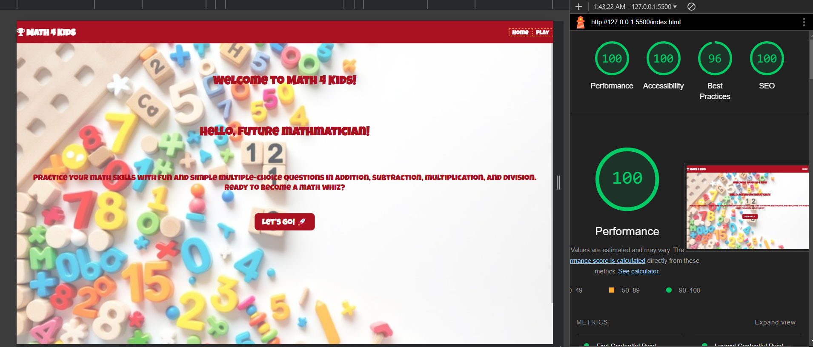
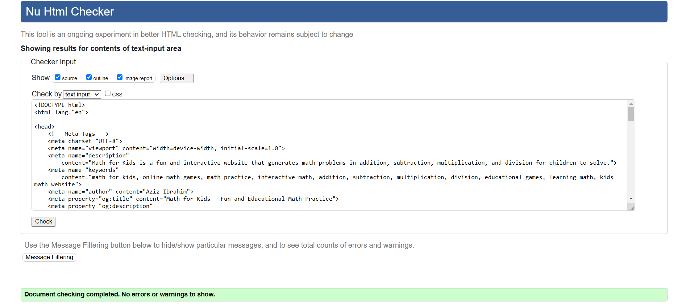

# Math4Kids

Math4Kids is a fun, interactive educational platform designed to help children strengthen their mathematical skills through engaging activities and exercises. The application is tailored to promote learning in a playful and stress-free environment, making math enjoyable for kids of all ages.

---

## Table of Contents

1. [User Stories](#user-stories)
   - [First Time Visitor Goals](#first-time-visitor-goals)
   - [Returning Visitor Goals](#returning-visitor-goals)
   - [Frequent Visitor Goals](#frequent-visitor-goals)

2. [Features](#features)
   - [Homepage](#homepage)
   - [Game Modes](#game-modes)
   - [Progress Tracking](#progress-tracking)
   - [Settings](#settings)

3. [Technologies Used](#technologies-used)

4. [Design](#design)
   - [Color Scheme](#color-scheme)
   - [Typography](#typography)
   - [Wireframes](#wireframes)

5. [Testing](#testing)
   - [Cross-Browser Compatibility](#cross-browser-compatibility)
   - [Responsive Design Testing](#responsive-design-testing)
   - [Accessibility Testing](#accessibility-testing)
   - [Manual Testing](#manual-testing)

6. [Deployment](#deployment)
   - [Deployment to GitHub Pages](#deployment-to-github-pages)
   - [Local Deployment](#local-deployment)

7. [Future Improvements](#future-improvements)

8. [Credits](#credits)
   - [Content](#content)
   - [Media](#media)
   - [Tools](#tools)

9. [Acknowledgments](#acknowledgments)

---

## User Stories

### First Time Visitor Goals:

- As a First Time Visitor, I want to understand the purpose of the site and see how it can help children learn math.
- As a First Time Visitor, I want to easily navigate through the platform and find different game modes.

### Returning Visitor Goals:

- As a Returning Visitor, I want to track my child’s progress and see their improvements over time.
- As a Returning Visitor, I want to customize difficulty levels to match my child’s learning pace.

### Frequent Visitor Goals:

- As a Frequent User, I want to discover new challenges or game updates to keep the experience fresh and engaging.
- As a Frequent User, I want quick access to my child’s saved progress and settings.

---

## Features

### Homepage

- **Welcome Section**: A bright and engaging introduction to the platform.


- **Game Previews**: Visual examples of different activities available.
  

### Game Modes

- **Quick Play**: Randomized math problems for immediate practice.

---

## Technologies Used

- **HTML**: Structure and layout.
- **CSS**: Styling and responsiveness.
- **JavaScript**: Interactive features and logic.

---

## Design

### Color Scheme


- Bright, child-friendly colors like Orange, blue, and yellow for an inviting and playful experience.

### Typography

- **Main Font**: Playful display font to match the theme, Sans-serif fonts for readability.


### Wireframes

- Created for desktop, tablet, and mobile views to ensure responsiveness.
#### Home Page
  

  


---

## Testing

### Cross-Browser Compatibility

- Verified in Chrome, Firefox, Safari, and Edge to ensure uniform appearance and functionality.

### Responsive Design Testing

- Ensured seamless usability on devices ranging from desktops to smartphones.


### Accessibility Testing

- Validated using Lighthouse tools.


- Verified contrast ratios and alternative text for images.




### Manual Testing

| Test Case                    | Steps                                | Expected Result              | Status |
|------------------------------|--------------------------------------|------------------------------|--------|
| Navigation Links             | Click each link                     | Navigate to correct section  | Pass   |
| Game Mode Functionality      | Select and complete a game mode     | Works as intended            | Pass   |
| Progress Tracking Updates    | Play and check progress graphs      | Reflects new data            | Pass   |

---

## Deployment

### Deployment to GitHub Pages

1. Navigate to the repository on GitHub.
2. Go to **Settings** > **Pages**.
3. Select the **Main** branch and save.
4. The site will be deployed, and a link will be provided.

### Local Deployment

1. Clone the repository:
   ```bash
   git clone https://github.com/Aziz-Ibrahim/math4kids.git
   ```
2. Navigate to the directory:
   ```bash
   cd math4kids
   ```
3. Open `index.html` in a browser.

---

## Future Improvements

### Gameplay
- Add multiplayer mode for collaborative learning.
- Introduce AI-generated personalized challenges.
- Expand problem types to include fractions and geometry.

### Progress Tracking

- Scores and Badges**: Visual indicators of achievements.
- Performance Graphs**: Weekly and monthly progress reports.

### Settings

- Customization**: Options to select difficulty levels, themes, and problem types.
- Parent Controls**: Manage access and monitor activities.
---
## Credits

### Content
- The idea behind this project was inspired by [Miguel Nunez](https://medium.com/@miguelznunez).
- All math problems and activities were designed in-house.

### Media

- Icons from [FontAwesome](https://fontawesome.com/).
- Images from [Stockcake](https://stockcake.com/i/colorful-math-fun_1523507_1174789).

### Tools

- [VS Code](https://code.visualstudio.com/) for development.
- [Lighthouse](https://developers.google.com/web/tools/lighthouse) for performance and accessibility checks.
- [WireframeCC](https://wireframe.cc/) for creating wireframes.

---

## Acknowledgments

- **Family and Friends**: For feedback and testing.
- **Online Communities**: Resources and tutorials for inspiration.
