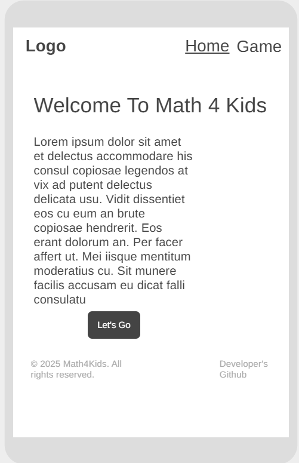

# [Math4Kids](https://aziz-ibrahim.github.io/math4kids/index.html)

[Math4Kids](https://aziz-ibrahim.github.io/math4kids/index.html) is a fun, interactive educational platform designed to help children strengthen their mathematical skills through engaging activities and exercises. The application is tailored to promote learning in a playful and stress-free environment, making math enjoyable for kids of all ages.

---

## Table of Contents

1. [User Stories](#user-stories)
   - [First Time Visitor Goals](#first-time-visitor-goals)
   - [Returning Visitor Goals](#returning-visitor-goals)
   - [Frequent Visitor Goals](#frequent-visitor-goals)

2. [Features](#features)
   - [Homepage](#homepage)
   - [Game Modes](#game-modes)
   - [Progress Tracking](#progress-tracking)
   - [Settings](#settings)

3. [Technologies Used](#technologies-used)

4. [Design](#design)
   - [Color Scheme](#color-scheme)
   - [Typography](#typography)
   - [Wireframes](#wireframes)

5. [Testing](#testing)
   - [Cross-Browser Compatibility](#cross-browser-compatibility)
   - [Responsive Design Testing](#responsive-design-testing)
   - [Accessibility Testing](#accessibility-testing)
   - [Manual Testing](#manual-testing)

6. [Deployment](#deployment)
   - [Deployment to GitHub Pages](#deployment-to-github-pages)
   - [Local Deployment](#local-deployment)

7. [Future Improvements](#future-improvements)

8. [Credits](#credits)
   - [Content](#content)
   - [Media](#media)
   - [Tools](#tools)

9. [Acknowledgments](#acknowledgments)

---

## User Stories

### First Time Visitor Goals:

- As a First Time Visitor, I want to understand the purpose of the site and see how it can help children learn math.
- As a First Time Visitor, I want to easily navigate through the platform and find different game modes.

### Returning Visitor Goals:

- As a Returning Visitor, I want to track my child’s progress and see their improvements over time.
- As a Returning Visitor, I want to customize difficulty levels to match my child’s learning pace.

### Frequent Visitor Goals:

- As a Frequent User, I want to discover new challenges or game updates to keep the experience fresh and engaging.
- As a Frequent User, I want quick access to my child’s saved progress and settings.

---

## Features

### Homepage

- **Welcome Section**: A bright and engaging introduction to the platform.


### Game Modes

- **Quick Play**: Randomized math problems for immediate practice in four modes: 
- Addition.
- Subtraction.
- Multiplication.
- Division.
  

---

## Technologies Used

- **HTML**: Structure and layout.
- **CSS**: Styling and responsiveness.
- **JavaScript**: Interactive features and logic.
- **[Jest](https://jestjs.io/)**: Javascript testing.
- **[VS Code](https://code.visualstudio.com/)**: for development and Jest package installation.
- **[GitHub](https://github.com/)**: for storing the code.
- **[GitHub Pages](https://github.com/skills/github-pages)**: for web deployment.
- **[W3C Markup Validation Service](https://validator.w3.org/)**: for checking HTML structure.
- **[CSS Validation Services](https://jigsaw.w3.org/css-validator/)**: for testing CSS code.
- **[Lighthouse](https://developers.google.com/web/tools/lighthouse)**: for performance and accessibility checks.
- **[WireframeCC](https://wireframe.cc/)**: for creating wireframes.
- **[Image Resizer](https://imageresizer.com/)**: for sizing hero image.

---

## Design

### Color Scheme


- Bright, child-friendly colors like Orange, blue, and yellow for an inviting and playful experience.

### Typography

- **Main Font**: Playful display font to match the theme, Sans-serif fonts for readability.


### Wireframes

- Created for desktop, tablet, and mobile views to ensure responsiveness.
#### Home Page
  

  


---

## Testing

### Cross-Browser Compatibility

- Verified in Chrome, Firefox, Safari, and Edge to ensure uniform appearance and functionality.

### Responsive Design Testing

- Ensured seamless usability on devices ranging from desktops to smartphones.


### Accessibility Testing

- Validated using Lighthouse tools.


- Verified contrast ratios and alternative text for images.

- HTML markup validation.


- CSS validation.

- Javascript testing in JSHint.


---

### Manual Testing

| Test Case                    | Steps                                                     | Expected Result                                                                 | Status |
|------------------------------|----------------------------------------------------------|---------------------------------------------------------------------------------|--------|
| Navigation Links             | 1. Click on each navigation link in the header.          | The page navigates to the correct page without errors.                       | Pass   |
| Game Mode Functionality      | 1. Select a game mode from the dropdown. <br>2. Complete a round of the selected game mode. | The game functions correctly and responds appropriately to inputs.              | Pass   |
| Wrong answer Shake Animation        | 1. Start the game. <br>2. Select an incorrect answer.    | The equation display briefly "shakes" to indicate the incorrect selection.      | Pass   |
| Correct Answer green background       | 1. Start the game. <br>2. Select a correct answer.       | The selected answer changes style (green background) to confirm correct answer. | Pass   |
| New Equation Generation      | 1. Start the game. <br>2. Answer the first question correctly. <br>3. Check the equation display. | A new equation is displayed immediately with different numbers.    | Pass   |
| Score Incrementation         | 1. Start the game and note the initial score (0). <br>2. Answer a question correctly. <br>3. Observe the score display. | The score increments by 1 for each correct answer and reflects your performance. | Pass   |


### Jest Unit Testing

The following Jest tests were created to ensure the correctness of key functions, more detailes on jest testing can be found [here](assets/js/test/game.test.js)

#### 1. **Dropdown Menu Tests**

- Verify that the dropdown menu toggles between open and closed states:

```javascript
import { toggleDropdown } from './gameModule';

test('toggleDropdown toggles the open class on the menu', () => {
    const menu = document.createElement('div');
    toggleDropdown(menu);
    expect(menu.classList.contains('open')).toBe(true);
    toggleDropdown(menu);
    expect(menu.classList.contains('open')).toBe(false);
});
```

#### 2. **Equation Generation Tests**

- Ensure that equations generated in different modes are correct:

```javascript
import { generateEquation } from './gameModule';

test('generateEquation produces valid addition results', () => {
    const { num1, num2, answer, operator } = generateEquation('addition');
    expect(answer).toBe(num1 + num2);
    expect(operator).toBe('+');
});

test('generateEquation ensures no division by zero', () => {
    const { num1, num2, operator } = generateEquation('division');
    expect(num2).not.toBe(0);
    expect(operator).toBe('÷');
});
```

#### 3. **Game Option Selection Tests**

- Validate the behavior when a correct or incorrect answer is chosen:

```javascript
import { handleOptionClick } from './gameModule';

test('handleOptionClick returns true for correct answers', () => {
    const mockOption = { querySelector: () => ({ textContent: '5' }) };
    const regenerateEquation = jest.fn();
    const correct = handleOptionClick(mockOption, regenerateEquation);
    expect(correct).toBe(true);
});

test('handleOptionClick returns false for incorrect answers', () => {
    const mockOption = { querySelector: () => ({ textContent: '3' }) };
    const regenerateEquation = jest.fn();
    const incorrect = handleOptionClick(mockOption, regenerateEquation);
    expect(incorrect).toBe(false);
});
```

---

## Deployment

### Deployment to GitHub Pages

- The project was deployed to [GitHub Pages](https://pages.github.com/), a live version of the website can be found [here](https://aziz-ibrahim.github.io/math4kids/index.html)

### Local Deployment

1. Clone the repository:
   ```bash
   git clone https://github.com/Aziz-Ibrahim/math4kids.git
   ```
2. Navigate to the directory:
   ```bash
   cd math4kids
   ```
3. Open `index.html` in a browser.

---

## Future Improvements
### Developer Improvement
- At the time of creating this project, I wasn't very confident in testing with Jest, so I created a replica of my game.js file to be used as an ES module that I can export from for testing while maintaining DOM accessibility  on the main Javascript file. I would like to improve on that field. 
### Gameplay
- Add multiplayer mode for collaborative learning.
- Expand problem types to include fractions and geometry.

### Progress Tracking

- **Scores and Badges**: Visual indicators of achievements.
- **Performance Graphs**: Weekly and monthly progress reports.

### Settings

- **Customization**: Options to select difficulty levels, themes, and problem types.
- **Parent Controls**: Manage access and monitor activities.
---
## Credits

### Content
- The idea behind this project was inspired by [Miguel Nunez](https://medium.com/@miguelznunez).
- All math problems and activities were designed in-house.

### Media

- Icons from [FontAwesome](https://fontawesome.com/).
- Images from [Stockcake](https://stockcake.com/i/colorful-math-fun_1523507_1174789).
- Favicon from [favicon.io](https://favicon.io/favicon-generator/)

### Tools

- [VS Code](https://code.visualstudio.com/) for development.
- [Lighthouse](https://developers.google.com/web/tools/lighthouse) for performance and accessibility checks.
- [WireframeCC](https://wireframe.cc/) for creating wireframes.
- [Image Resizer](https://imageresizer.com/) for sizing hero image.

---

## Acknowledgments
- **[Iuliia Konovalove](https://github.com/IuliiaKonovalova)**: For feedback and improvement insights.
- **Family and Friends**: For feedback and testing.
- **Online Communities**: Resources and tutorials for inspiration.
